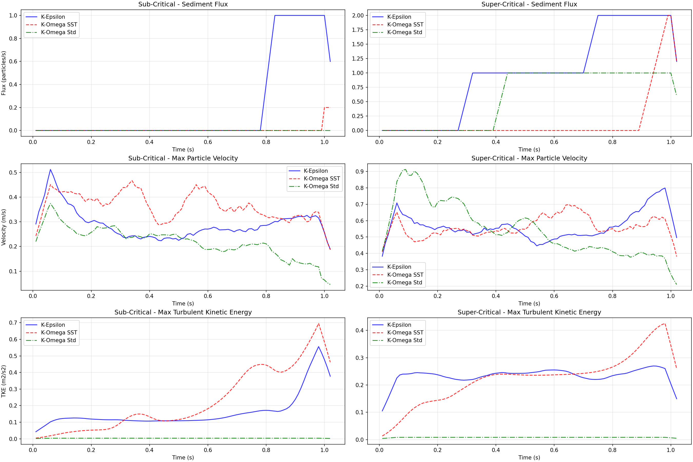
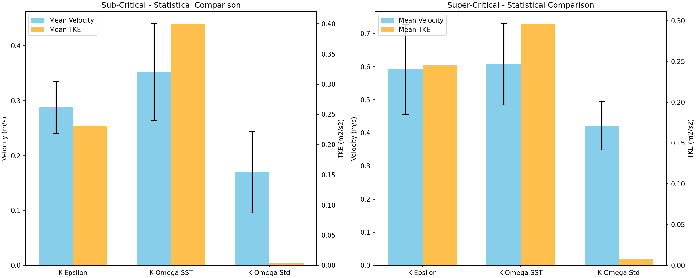

# RANS Turbulence Model Comparison Report

## Executive Summary
This report compares the performance of k-epsilon, k-omega standard, and k-omega SST models in sub-critical and super-critical sediment transport regimes.

## Statistical Summary (Developed Flow)
| Scenario | Model | Mean Velocity (m/s) | Max Velocity (m/s) | Mean TKE (m2/s2) | Mean Flux |
| :--- | :--- | :--- | :--- | :--- | :--- |
| Sub-Critical | K-Epsilon | 0.288 | 0.390 | 0.2313 | 0.43 |
| Sub-Critical | K-Omega SST | 0.352 | 0.524 | 0.4002 | 0.02 |
| Sub-Critical | K-Omega Std | 0.170 | 0.462 | 0.0038 | 0.00 |
| Super-Critical | K-Epsilon | 0.592 | 0.879 | 0.2460 | 1.59 |
| Super-Critical | K-Omega SST | 0.607 | 0.870 | 0.2962 | 0.33 |
| Super-Critical | K-Omega Std | 0.422 | 0.627 | 0.0084 | 1.00 |

## Key Observations
1. **Velocity Prediction**: Compare the 'Mean Velocity' column. Higher velocity usually implies higher shear stress.
2. **Turbulence Levels**: 'Mean TKE' indicates the energy available for suspension. k-epsilon often over-predicts TKE near walls compared to k-omega SST.
3. **Stability**: The standard deviation (error bars in the bar chart) indicates the fluctuation/instability of the solution.

## Visualizations
### Time Series Evolution

### Statistical Comparison

